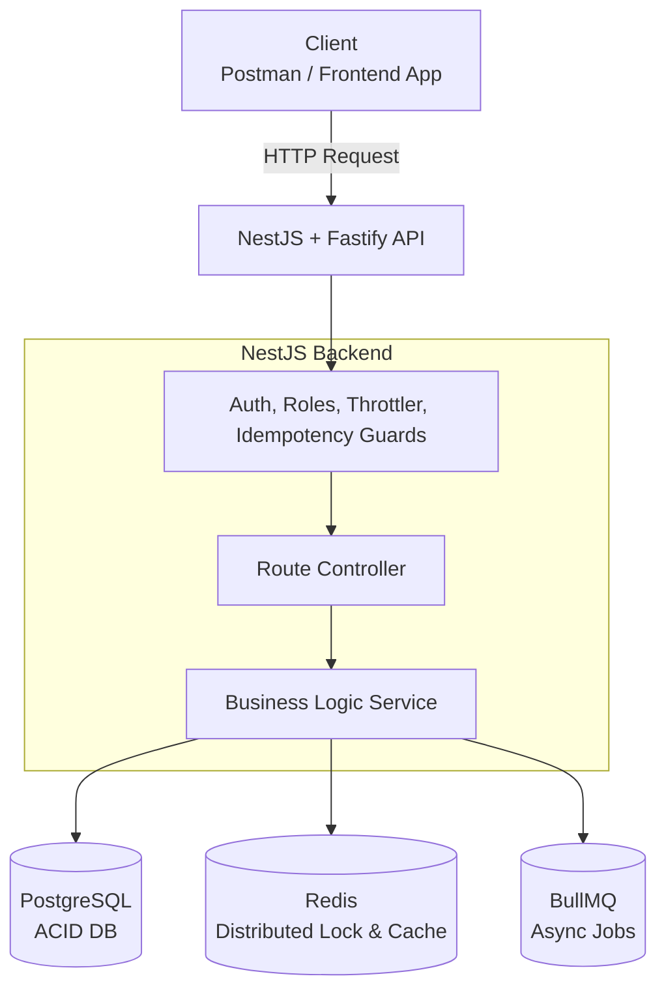
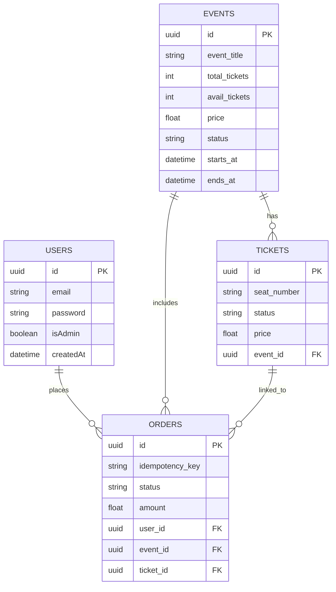

<div align="center">
  <h1>🎟️ ScaleTick</h1>
  <p><strong>A production-grade flash sale and ticketing engine</strong></p>
  <p>Built to handle thousands of users competing for limited tickets at the exact same moment, with <b>zero overselling</b> and <b>zero duplicate orders</b>.</p>

  
  
  
  
  
</div>

---

## 🤔 What Problem Does This Solve?

Imagine a major concert announces tickets at 10:00 AM.

- **10:00:00.000 AM** — Tickets go live
- **10:00:00.001 AM** — 10,000 users click "Buy" simultaneously
- **10:00:00.002 AM** — Only 500 tickets are available

### ❌ What happens without proper engineering?

- The same ticket is sold to multiple people.
- The server crashes under immense load.
- Users are charged twice due to double-clicking.
- Data corruption occurs in the database.

### ✅ What ScaleTick Guarantees:

- **Exactly 500 tickets sold** — never more.
- Server stays responsive and stable under load.
- Double-clicks are safe — users are only charged once.
- Zero data corruption.

> _This is the exact problem solved by ticketing giants like BookMyShow, IRCTC, and LiveNation._

---

## ⚡ Quick Start & Live Demo

> **Note:** The setup steps have been unified to provide a single, reliable way to get the project running locally in seconds.

```bash
# 1. Clone the repository
git clone https://github.com/pradhanji09/ScaleTick.git
cd ScaleTick/backend

# 2. Setup Environment Variables
cp .env.example .env

# 3. Start Infrastructure (PostgreSQL & Redis)
docker compose up -d

# 4. Install Dependencies & Run
npm install
npm run start:dev
```

### 🧭 Explore the App

- **API Explorer (Swagger):** [http://localhost:3000/api/docs](http://localhost:3000/api/docs)
- **Health Check:** [http://localhost:3000/health](http://localhost:3000/health)

---

## 🏗️ System Architecture



---

## 🎯 The Booking Flow

This is the most critical part of ScaleTick. Here is exactly what happens when you click "Book":

1. **🛡️ Idempotency Check (Redis)**
   - Already seen this request? → _Return cached response_
   - Request in progress? → _Return `409 Conflict`, try again_
   - New request? → _Mark as `PROCESSING`, continue_
2. **✅ Validation**
   - Is event `LIVE`? Is ticket available? → _If no, reject._
3. **🔒 Acquire Redis Lock**
   - Lock key: `lock:ticket:{ticketId}`
   - If locked by someone else, return `503 Service Unavailable` to retry.
4. **💽 Database Transaction (Pessimistic Lock)**
   - `SELECT ticket FOR UPDATE`
   - Mark ticket `SOLD`, create order `CONFIRMED`.
   - Decrement `available_tickets`. If `0`, set event to `SOLD_OUT`.
   - `COMMIT`
5. **🔓 Release Redis Lock**
   - Safe release using a Lua script to ensure we only release our own lock.
6. **💾 Cache Response**
   - Mark idempotency key as `COMPLETED` and store for 24 hours.
7. **📨 Async Job (BullMQ)**
   - Push confirmation email job to queue (returns response to user immediately without waiting).

---

## 🛡️ Core Defense Mechanisms

### 1. Preventing Overselling

We use a **Two-Layer Protection** strategy:

- **Layer 1: Redis Distributed Lock:** "Only one booking can process a specific ticket at a time." (NX, EX 10)
- **Layer 2: PostgreSQL Pessimistic Lock:** "Even if two requests slip through, the database guarantees only one wins." (`SELECT ... FOR UPDATE`)

### 2. Preventing Double Charging

- **Idempotency Keys:** The client generates a UUID before clicking. If the network drops and they click again, the server recognizes the `x-idempotency-key` in Redis, skips processing, and returns the cached success response.

---

## 🧠 Design Patterns Used

- **🚦 Finite State Machine (FSM):** Controls the Event lifecycle (`DRAFT` → `SCHEDULED` → `LIVE` → `SOLD_OUT` / `ENDED`). Illegal transitions are impossible.
- **🏷️ Strategy Pattern:** Supports different pricing models (Fixed, EarlyBird, Dynamic) without modifying core code (Open/Closed Principle). [In Progres]
- **🏭 Factory Pattern:** Centralizes complex Event creation, enforcing defaults and standardizing dates.
- **🔄 Transformer Pattern:** Shapes API responses, guaranteeing that sensitive data (like passwords) never leaks from the DB to the client.

---

## 📊 Load Test Results

Proven under real concurrent load using `k6`.

| Scenario               | Details                                             | Result                                                                                       |
| ---------------------- | --------------------------------------------------- | -------------------------------------------------------------------------------------------- |
| **Concurrent Booking** | 100 users hit "Book" simultaneously for 50 tickets. | **50 successful, 50 failed.** Exactly 50 tickets sold. 0 Overselling. 100% checks succeeded. |
| **Idempotency**        | Same user, same key, 2 simultaneous requests.       | **1 successful, 1 blocked.** Double click is 100% safe.                                      |

_See [load-tests/LOAD_TEST_RESULTS.md](./load-tests/LOAD_TEST_RESULTS.md) for detailed reports._

---

## 🚀 Tech Stack

| Layer             | Technology              | Purpose                                           |
| ----------------- | ----------------------- | ------------------------------------------------- |
| **Framework**     | NestJS + Fastify        | Fast, structured, decorator-based API             |
| **Language**      | TypeScript              | Type safety and enhanced DX                       |
| **Database**      | PostgreSQL + TypeORM    | ACID transactions, row-level locking, ORM         |
| **Cache & Lock**  | Redis + ioredis         | Atomic operations, distributed state              |
| **Queue**         | BullMQ                  | Persistent background jobs, retry logic           |
| **Auth**          | JWT + Passport + bcrypt | Industry-standard security                        |
| **Ops & Testing** | Docker, Pino, k6        | Containerization, fast JSON logging, load testing |

---

## 🗄️ Database Schema



---

## 📁 Project Structure

```text
src/
├── auth/                    ← JWT auth, register, login
├── events/                  ← Flash sale management & FSM transitions
├── tickets/                 ← Ticket inventory
├── orders/                  ← Core booking engine
├── common/                  ← Shared guards, decorators, interceptors, Redis lock
├── queue/                   ← BullMQ job processors
└── health/                  ← DB & Redis health checks
```

---

## 🔌 API Endpoints

**🔐 Authentication**

- `POST /auth/register` — Create account
- `POST /auth/login` — Get JWT token

**🎟️ Events**

- `POST /events` — Create event _(Admin)_
- `GET /events` — List live & scheduled events
- `GET /events/:id` — Single event details
- `GET /events/:id/tickets` — Available tickets
- `PATCH /events/:id/status` — Change event state _(Admin)_

**💳 Orders**

- `POST /orders/book` — Book a ticket _(Requires `x-idempotency-key`)_
- `GET /orders/my-orders` — My booking history

---

## 🔐 Security Highlights

- ✅ **JWT Auth** on all private routes
- ✅ **bcrypt** password hashing (10 rounds)
- ✅ **Rate Limiting** (Redis-backed: Login 5/min, Book 10/min)
- ✅ **Helmet** for secure HTTP headers
- ✅ Strict **Input Validation** on every endpoint
- ✅ Admin routes protected by **Role Guards**
- ✅ **UUID Validation** for idempotency keys
- ✅ Lock token ownership validation

---

## 🗺️ What's Next?

- [ ] **Payment Gateway Integration:** Razorpay implementation (PENDING → payment → CONFIRMED flow).
- [ ] **TypeORM Migrations:** Transition to versioned schema changes instead of synchronization.
- [ ] **Observability:** Prometheus + Grafana dashboards for real-time monitoring.
- [ ] **Multi-Ticket Booking:** Atomic multi-lock acquisition for booking several tickets at once.

---

## 👤 Author

**Sourav Pradhan**  
_Software Engineer | Node.js | NestJS | Distributed Systems_

[](https://www.linkedin.com/in/sourav-pradhann)
[](https://github.com/pradhanji09)
